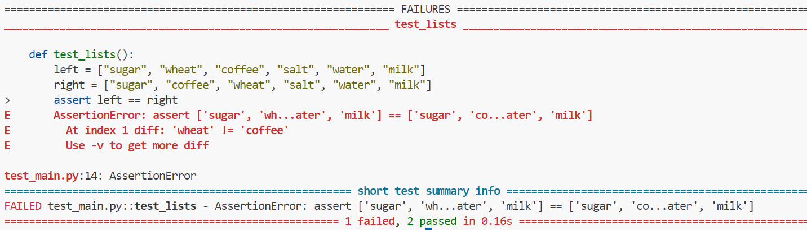

## Introducción al Test Driven Development y Conceptos básicos de Pytest

Al empezar a leer sobre las pruebas de código en Python puede ser abrumador. La biblioteca estándar de Python `unittest`ofrece utilidades funciones para escribir pruebas, pero con algunos inconvenientes que a veces resulta más dificil.

[Pytest](https://docs.pytest.org/en/7.4.x/getting-started.html) es una de las herramientas y frameworks de pruebas más populares para Python. Tanto te puede ayudar en escenarios de prueba complejos como también en funciones para escribir pruebas no demasiado complejas.

Pytest es altamente configurable y puede manejar pruebas de código complejas y estructuradas. Aún asi, no requiere muchos conocimientos para empezar a escribir pruebas. De hecho, es un gran ventaja que mientras más rápido pongamos manos a la obra, mejor.

**Comencemos a realizar pruebas con pytest.**

🌟Al final de este mini-tutorial, tendrás todo lo que necesitas para empezar a escribir las primeras pruebas y ejecutarlas con Pytest.

### Convenciones

Antes de profundizar con las pruebas, debemos cubrir algunas de las convenciones de prueba en las que se basa *Pytest*.

No hay reglas difíciles, pero hay que entender las que hay, para poder aprovechar la detección y ejecución automáticas de pruebas sin necesidad de ninguna configuración adicional.

### Archivos de prueba y directorio de pruebas

El directorio principal de las pruebas es el directorio `tests`. Puede colocar este directorio en la raíz del proyecto, aunque también es común verlo junto a los scripts de código.

> Nota⚠️

Usaremos de forma predeterminada tests en la raíz de un proyecto.

**Supongamos que asi es cómo se ve la raíz de un pequeño proyecto de Python denominado jformat:**

```├── README.md
├── jformat
│   ├── __init__.py
│   └── main.py
├── setup.py
└── tests
    └── test_main.py
    
```

El directorio `tests` se encuentra en la raíz del proyecto con un único archivo de prueba. En este caso, el archivo de prueba se denomina test_main.py. **Estas son dos convenciones importantes:**

1. Uso del nombre `tests` en la carpeta para colocar archivos de prueba y directorios de pruebas anidados
2. Prefijo de archivos de prueba con `test_`. El prefijo indica que el archivo contiene código de prueba.

### ⚠️ Precaución

*Evita usar `test` (en singular) como nombre de directorio. El nombre test es un módulo de Python, la creación de un directorio con el mismo nombre lo invalidaría. Use siempre el plural tests en su lugar.*

## Funciones de prueba

Uno de los puntos fuertes de  Pytest es que permite escribir `funciones de prueba`. De forma similar a los archivos de prueba, la función debe tener el prefijo `test_`. Que es el que se asegurará de que Pytest recopile la prueba y la ejecute.

A continuación una función de prueba sencilla:

```
def test_main():
    assert "a string value" == "a string value"
    
```
### Clases de prueba y métodos de prueba

Similar a las otras convenciones mencionadas, las clases de prueba y los métodos deben tener el prefijo `test`.

`Aqui muestro cómo sería una clase de prueba pequeña que compruebe los nombres de usuario en una aplicación:`

```
class TestUser:

    def test_username(self):
        assert default() == "default username"
```


⚠️Esta es una diferencia principal con la biblioteca `unittest` de Python: no es necesario realizar ninguna herencia. 

- Las clases de prueba tienen el prefijo ´Test´
- Los métodos de prueba tienen el prefijo ´test_´

## Ejecutor de pruebas

Pytest no es solo un marco para crear las pruebas sino que por supuesto, **las ejecuta**. El ejecutor de pruebas es un ejecutable para la cmd, que puede hacer:

- Realizar la recopilación de los archivos de pruebas, buscar todos los archivos, clases y funciones de prueba para completar la ejecución.
- Iniciar la ejecución de todas las pruebas.
- Realiza el seguimiento de los errores y superar las pruebas.
- ⭐Proporciona tambien informes completos al final de la ejecución de la prueba

**Instalar pytest, WEB OFICIAL**](https://docs.pytest.org/en/7.4.x/getting-started.html)

pytest requiere: Python 3.7+ or PyPy3.

```
pip install -U pytest
pytest --version
pytest 7.4.2

```
---
Vamos a escribir la siguiente funcion en el archivo *test_main.py* para ver como se comporta pytest

```
# funcion de test_main

def test_main():
    assert True
```

En una terminal, en la ruta de acceso donde existe el archivo test_main.py, podemos escribir simplemente el ejecutable `pytest`:


## Como hacer asserts de manera fácil

**Como habrás notado**, todos los ejemplos de prueba utilizan la instrucción "assert". En Python, normalmente evitamos el uso de "assert" para las pruebas debido a que no proporciona informes detallados en caso de error en la aserción. Sin embargo, Pytest cambia esta esta dinámica.

En Pytest, la instrucción "assert" puede realizar comparaciones enriquecidas en segundo plano sin requerir código adicional o realizar configuraciones extrañas. Esto significa que puedes utilizar los operadores estándar de Python, como >, <, !=, >= o <=, al crear tus aserciones. **Esta característica es una de las ventajas clave de Pytest**, no necesitas aprender una nueva sintaxis para escribir aserciones.

Ahora, veamos esta ventaja cuando trabajamos con comparaciones comunes, utilizando objetos de Python. Por ejemplo, Pytest genera los informes de errores al comparar cadenas muy largas

```
def test_long_strings():
    izquierda = "Esta es una cadena muy larga que se va a comparar con otra cadena larga"
    derecha = "Esta es una cadena muy larga que se va a comparar con otra cadena larga"
    assert izquierda == derecha
```


Pytest tambien puede ayudar con otros objetos y estructuras de datos. Así se comporta con las listas:



**Veamos ahora con comparando diccionarios**

```
def test_diccionarios():
    izquierda = {"calle": "Ferry Ln.", "número": 39, "estado": "Nevada", "código postal": 30877, "condado": "Frett"}
    derecha = {"calle": "Ferry Lane", "número": 38, "estado": "Nevada", "código postal": 30877, "condado": "Frett"}
    assert izquierda == derecha
```
Como vemos ver nos da una vision clara de que es lo que está ocurriendo, comparar dos diccionarios grandes, si hay errores, puede ser abrumador, pero Pytest realiza un trabajo sobresaliente al **proporcionar contexto e identificar el error:**


Además nos dice que si queremos un informe mucho más extenso podemos usar el comando `-vv` para mostrarlo:

```
pytest -vv
```
⚠️En esta prueba, en el diccionario hay dos errores. Uno es que el valor "calle" es diferente y el otro es que "número" no coincide.


**✍️Resumen**: Al ejecutar  `pytest -vv`, el informe nos da más detalles y proporciona una comparación muy precisa. No solo detecta y muestra el error, sino qué también te permite realizar cambios para corregir el problema rápidamente.


## Parte 2: Clases y metodos de prueba en pytest

[ Continuar ](){ .md-button }

